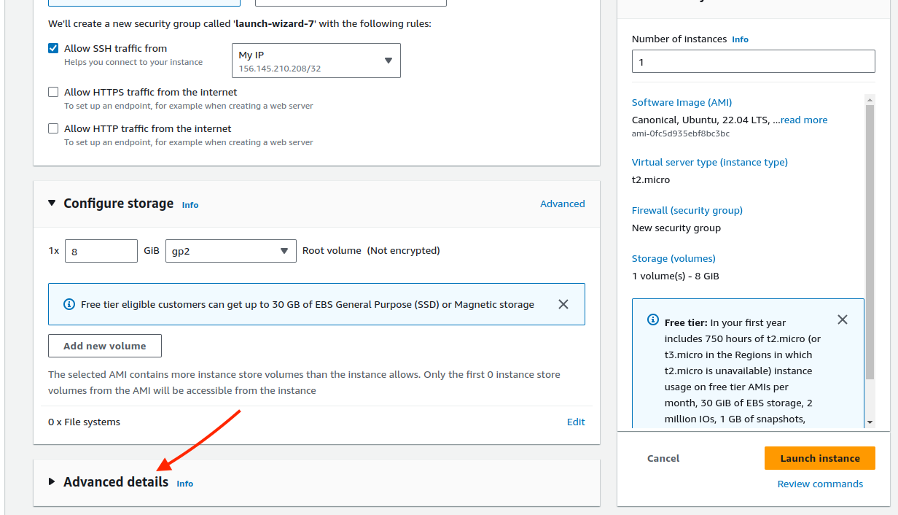

## AWS_autoshutdown

This repository includes a little script to shutdown automatically AWS instances if the user isn't running processes or connected. First of all, checks that there are no processes being run and, if that's not the case, also checks if there is an active ssh connection. If both of them return `FALSE`, shutdowns the instance in 15min.

For this script to work, you need to look for the **Advanced details** section at the end of AWS EC2 instance launch section:




The following code has to be added to the **Blank space** at the end of the **Advanced details** section:

```
#!/bin/bash

## script for autoshutdown
## Change the username variable content with whatever user you use. For admin AWS EC2, ubuntu is the default.

username=ubuntu

echo -e "\nusername=$username\nSHELL=/bin/bash\n" >> /root/.bashrc
source /root/.bashrc

curl https://raw.githubusercontent.com/Josuerinho/AWS_autoshutdown/main/automatic_shutdown_AWS_EC2_instances_script_deploy.sh -o /root/.autoshutdown.sh

sudo chmod 700 ~/.autoshutdown.sh

# Cron job syntax to Display the current crontab for the root user and append the new line
(echo "$(sudo crontab -u root -l)" && echo "*/15 * * * * /root/.autoshutdown.sh &> /dev/null") | sudo crontab -u root -


```

